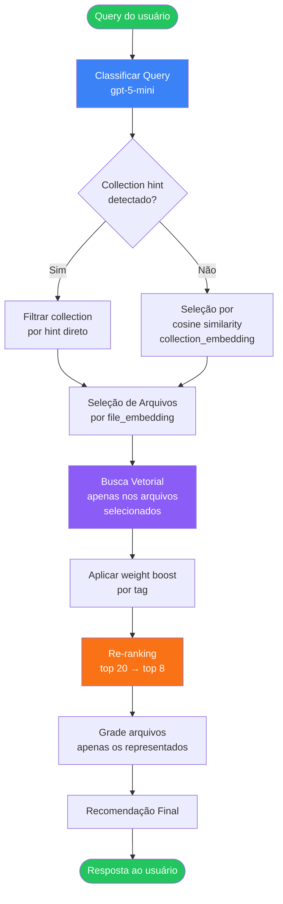
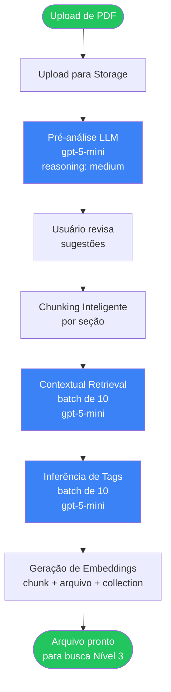

# PRD — Evolução do Sistema RAG para Maturidade Nível 3
## Health Plan Agent v2 — Retrieval-Augmented Generation com Filtragem Adaptativa

**Versão:** 1.0
**Data:** 2026-03-20
**Autor:** Equipe de Produto
**Status:** Aprovado para Implementação

---

## Sumário Executivo

O sistema RAG atual (Nível 1) do Health Plan Agent v2 realiza buscas vetoriais sem pré-filtragem, avaliando todos os chunks de todos os arquivos para cada query. Isso resulta em latência de **71-81 segundos** por busca e **8-10 chamadas LLM**, tornando a experiência inviável para escala com 20-30 documentos pesados.

Este PRD define a evolução para o **Nível 3 de Maturidade RAG**, introduzindo:
- Filtragem adaptativa em múltiplos níveis (collection → arquivo → chunk)
- Enriquecimento de chunks com tags semânticas, pesos e contexto posicional
- Interface de gestão de chunks e tags para operadores
- Meta de latência: **menor que 15 segundos** com **2-3 chamadas LLM**

---

## Tabela Comparativa: Nível 1 vs Nível 2 vs Nível 3

| Dimensão | Nível 1 (Atual) | Nível 2 (Intermediário) | Nível 3 (Meta) |
|----------|-----------------|-------------------------|----------------|
| **Chunking** | Tamanho fixo global | Tamanho por arquivo | Inteligente por seção + contextual retrieval |
| **Pré-filtragem** | Nenhuma | Por collection | Por collection + arquivo + tags |
| **Metadata** | plan_metadata JSONB | Tags manuais básicas | Tags hierárquicas + pesos + section_type |
| **Contexto do chunk** | Nenhum (chunk órfão) | Descrição do arquivo | Parágrafo de contexto posicional (Anthropic) |
| **Busca vetorial** | Todos os chunks | Todos os chunks da collection | Apenas chunks dos arquivos filtrados |
| **Grading LLM** | 8-10 chamadas | 4-6 chamadas | 2-3 chamadas |
| **Latência** | 71-81 s | 30-45 s | < 15 s |
| **Upload** | Manual, sem análise | Análise básica | Pré-análise automática + sugestão de tags |
| **UI de chunks** | Nenhuma | Listagem simples | Editor visual com agrupamento por seção |
| **Escala** | 5-8 documentos | 10-15 documentos | 20-30 documentos pesados |
| **Embeddings superiores** | Nenhum | Embedding de collection | Embedding de collection + arquivo para routing |
| **Re-ranking** | Nenhum | Score de similaridade | Cross-encoder ou LLM rápido top-N |

---

## Contexto e Motivação

### Sistema Atual (Nível 1)

O pipeline RAG atual funciona da seguinte forma:

```
┌─────────────────────────────────────────────────────────────────┐
│                    PIPELINE NÍVEL 1 (ATUAL)                      │
└─────────────────────────────────────────────────────────────────┘

Usuário pergunta
        │
        ▼
 Gera embedding da query
        │
        ▼
 Busca vetorial em TODOS os chunks de TODOS os arquivos
 (sem pré-filtragem)
        │
        ▼
 Para cada ARQUIVO (em paralelo, batch de 3):
   └── Concatena todos os chunks do arquivo
   └── Envia para LLM: "Este plano serve para este cliente?"
   └── LLM retorna análise textual + nível de relevância
        │
        ▼
 Grade por COLLECTION:
   └── Agrupa arquivos por collection
   └── LLM sintetiza todos os planos da collection
        │
        ▼
 Retorna análises textuais consolidadas
```

**Problemas mensurados:**
- 71-81 segundos para 3-5 arquivos
- 8-10 chamadas LLM em sequência
- Sem pré-filtragem → todos os arquivos são avaliados mesmo quando a query é específica
- Chunks sem contexto posicional ("chunk órfão")
- Não escala para 20-30 documentos

### Hierarquia de Dados Atual

```
Assistant
  └── Collections (operadoras: Bradesco, Unimed, SulAmérica...)
        └── Files (documentos PDF de planos)
              └── file_items / chunks (texto com embedding 1536-d)
```

**Schema relevante:**
- `collections`: id, name, description, collection_type, chunk_size, chunk_overlap
- `files`: id, name, description, type, tokens, chunk_size, chunk_overlap
- `file_items`: id, file_id, content, tokens, openai_embedding vector(1536), plan_metadata JSONB
- `collection_files`: collection_id, file_id
- `assistant_collections`: assistant_id, collection_id

---

## Seção 1: Upload e Ingestão de Arquivos

### 1.1 Visão Geral do Fluxo

O novo fluxo de upload transforma a ingestão passiva em um processo ativo de enriquecimento automático:

```
┌─────────────────────────────────────────────────────────────────┐
│                   FLUXO DE UPLOAD NÍVEL 3                        │
└─────────────────────────────────────────────────────────────────┘

Usuário arrasta PDF
        │
        ▼
 [1] Upload do arquivo para storage (Supabase Storage)
        │
        ▼
 [2] PRÉ-ANÁLISE AUTOMÁTICA (LLM gpt-5-mini, reasoning_effort: medium)
     ├── Identifica: operadora, tipo de plano, abrangência geográfica
     ├── Sugere: nome do arquivo, descrição do arquivo
     ├── Detecta seções: preço, cobertura, rede credenciada, carência,
     │   coparticipação, exclusões, reembolso, documentação
     └── Sugere tags existentes e novas tags necessárias
        │
        ▼
 [3] INTERFACE DE CONFIRMAÇÃO (usuário revisa em < 30s)
     ├── Confirma/edita nome e descrição sugeridos
     ├── Confirma/edita tags sugeridas para o documento
     ├── Configura chunk_size e chunk_overlap por arquivo
     │   (padrão inteligente sugerido pela pré-análise)
     └── Mapeia seções detectadas para tags do sistema
        │
        ▼
 [4] CHUNKING INTELIGENTE
     ├── Divide o PDF respeitando limites de seções detectadas
     ├── Aplica chunk_size e chunk_overlap configurados por arquivo
     └── Preserva metadados posicionais (page_number, section)
        │
        ▼
 [5] ENRICHMENT POR CHUNK (em paralelo, batch de 10)
     ├── Contextual Retrieval (Anthropic): gera parágrafo de contexto
     │   "Este chunk faz parte da seção X do documento Y..."
     ├── Inferência de tags por chunk (LLM classifica cada chunk)
     ├── Atribui section_type, page_number, weight
     └── Gera embedding do chunk enriquecido
        │
        ▼
 [6] EMBEDDINGS DE NÍVEL SUPERIOR
     ├── Embedding do arquivo (nome + descrição + tags)
     └── Atualiza embedding da collection se necessário
        │
        ▼
 [7] Armazenamento no banco + atualização de índices
```

### 1.2 Pré-análise Automática por LLM

A pré-análise é executada sobre as primeiras páginas do PDF (até 10 páginas ou 8.000 tokens) para identificar o contexto do documento.

**Prompt de pré-análise (exemplo):**
```
Você é um especialista em planos de saúde brasileiros.
Analise este documento e responda em JSON:

{
  "sugerir_nome": "Nome descritivo do arquivo",
  "sugerir_descricao": "Descrição de 1-2 frases do que este documento cobre",
  "operadora": "Nome da operadora de saúde",
  "tipo_plano": "individual|familiar|empresarial|outro",
  "abrangencia": "nacional|regional|municipal",
  "secoes_detectadas": ["preço", "cobertura", "rede_credenciada", ...],
  "tags_sugeridas": ["tag1", "tag2"],
  "chunk_size_recomendado": 3000,
  "chunk_overlap_recomendado": 200,
  "justificativa_chunking": "Motivo para tamanho recomendado"
}
```

### 1.3 Contextual Retrieval (método Anthropic)

Baseado em: https://www.anthropic.com/news/contextual-retrieval

Para cada chunk gerado, o sistema gera um parágrafo de contexto posicional antes de criar o embedding. Isso melhora a recuperação em 35-49% ao eliminar "chunks órfãos".

**Exemplo de chunk sem contextual retrieval:**
```
"A coparticipação para consultas de especialistas é de 30%
do valor da consulta, limitada a R$ 45,00 por evento."
```

**Mesmo chunk com contextual retrieval:**
```
[CONTEXTO: Este trecho faz parte da seção "Coparticipação" do documento
"Bradesco Saúde - Plano Flex Nacional", especificamente das regras de
coparticipação para consultas médicas especializadas. O documento é
um contrato de plano de saúde individual da operadora Bradesco Saúde,
com abrangência nacional.]

"A coparticipação para consultas de especialistas é de 30%
do valor da consulta, limitada a R$ 45,00 por evento."
```

O embedding é gerado sobre o texto completo (contexto + chunk), mas apenas o chunk original é armazenado em `content`. O contexto é armazenado em `document_context`.

### 1.4 Configuração de Chunking por Arquivo

Cada arquivo tem sua própria configuração de chunking (já existe `chunk_size` e `chunk_overlap` na tabela `files`). A pré-análise sugere valores baseados no tipo de documento:

| Tipo de documento | chunk_size recomendado | chunk_overlap |
|-------------------|------------------------|---------------|
| Tabela de preços (tabular) | 1500 | 100 |
| Contrato de plano (texto denso) | 3000 | 300 |
| Guia de rede credenciada | 2000 | 150 |
| Material de marketing | 2500 | 200 |

---

## Seção 2: Gestão de Chunks (Frontend UI/UX)

### 2.1 Tela de Visualização de Chunks por Arquivo

**Localização:** `[workspaceid]/files/[fileId]/chunks`

```
┌─────────────────────────────────────────────────────────────────┐
│  Arquivo: Bradesco Saúde - Plano Flex Nacional          [Editar] │
│  Tags: [preço] [cobertura] [rede_credenciada] [carência]         │
│  Chunks: 47 total | 8 seções | Embedding: ✓ 47/47               │
├──────────────┬──────────────────────────────────────────────────┤
│  SEÇÕES      │  CHUNKS DA SEÇÃO: Cobertura (12 chunks)           │
│  ─────────── │  ─────────────────────────────────────────────── │
│  preço (8)   │  [▼ Chunk #12]  Página 4  Tags: [cobertura]      │
│  cobertura   │  "A Cobertura Básica inclui as seguintes          │
│   (12) ←    │  coberturas mínimas estabelecidas pela ANS..."    │
│  rede (9)    │  Tokens: 234 | Similaridade: — | Peso: 1.0       │
│  carência (5)│  [Editar] [Re-tag] [Ver contexto]                │
│  coprt. (4)  │  ─────────────────────────────────────────────── │
│  exclusão (5)│  [▼ Chunk #13]  Página 4  Tags: [cobertura]      │
│  reimb. (3)  │  "Coberturas adicionais disponíveis mediante..."  │
│  docs (1)    │  Tokens: 187 | Similaridade: — | Peso: 1.0       │
│              │  [Editar] [Re-tag] [Ver contexto]                │
│              │  ─────────────────────────────────────────────── │
│  [+ Nova Tag]│  [Carregar mais...]                               │
└──────────────┴──────────────────────────────────────────────────┘
```

**Funcionalidades:**
- Agrupamento por seção/tag (coluna esquerda como navegação)
- Visualização do conteúdo do chunk com truncamento inteligente
- Exibição de metadados: página, tokens, peso, status do embedding
- Preview do `document_context` (contextual retrieval) via botão "Ver contexto"
- Filtro por tag, página, tamanho de chunk

### 2.2 Edição Inline de Chunks

**Edição de tag:**
- Clique em uma tag do chunk → dropdown com tags disponíveis
- Trocar tag dispara atualização do embedding se tag afeta o texto de contexto

**Ajuste de peso:**
- Slider de 0.5 a 3.0 (incrementos de 0.1)
- Peso padrão: 1.0; boost recomendado: 1.5-2.0

**Edição de conteúdo:**
- Modal com textarea para editar o texto do chunk
- Aviso: "Editar conteúdo regenerará o embedding deste chunk"
- Botão "Salvar e Regenerar Embedding"

### 2.3 Re-chunking de Arquivo

Botão na tela do arquivo: "Re-chunkar com novos parâmetros"

```
┌─────────────────────────────────────────────────────────────────┐
│  Re-chunkar: Bradesco Saúde - Plano Flex Nacional               │
│                                                                  │
│  Chunk Size atual: 3000   Novo: [___3000___]                    │
│  Chunk Overlap atual: 300  Novo: [____300___]                   │
│                                                                  │
│  Estimativa: ~47 chunks → ~52 chunks                            │
│  Custo estimado: ~$0.12 em embeddings + ~$0.08 em contextual    │
│                                                                  │
│  ⚠ Esta operação deletará os 47 chunks existentes e criará novos │
│                                                                  │
│  [Cancelar]  [Re-chunkar e Re-embedar]                          │
└─────────────────────────────────────────────────────────────────┘
```

### 2.4 Busca/Filtro dentro dos Chunks

Campo de busca no topo da tela de chunks:
- Busca textual simples (ILIKE) no conteúdo dos chunks
- Filtro por tag (checkboxes)
- Filtro por página (range)
- Filtro por peso (dropdown: qualquer, > 1.0, = 1.0, < 1.0)

---

## Seção 3: Sistema de Tags e Pesos

### 3.1 Tags Pré-definidas do Sistema

| Tag | Slug | Descrição | Peso Boost Padrão | Cor |
|-----|------|-----------|-------------------|-----|
| Preço | `preco` | Tabelas de preços, mensalidades, valores | 2.0 | #22c55e |
| Cobertura | `cobertura` | O que o plano cobre | 1.8 | #3b82f6 |
| Rede Credenciada | `rede_credenciada` | Hospitais, clínicas, médicos | 1.6 | #8b5cf6 |
| Exclusão | `exclusao` | O que o plano NÃO cobre | 1.5 | #ef4444 |
| Carência | `carencia` | Períodos de carência por procedimento | 1.5 | #f97316 |
| Coparticipação | `coparticipacao` | Valores pagos por evento | 1.5 | #eab308 |
| Reembolso | `reembolso` | Regras e valores de reembolso | 1.4 | #14b8a6 |
| Documentação | `documentacao` | Documentos exigidos | 1.2 | #6b7280 |
| Regras Gerais | `regras_gerais` | Termos contratuais gerais | 1.0 | #94a3b8 |

### 3.2 Tags Hierárquicas

```
cobertura (pai)
  ├── cobertura_dental
  ├── cobertura_hospitalar
  ├── cobertura_ambulatorial
  └── cobertura_exames

rede_credenciada (pai)
  ├── rede_hospitais
  ├── rede_clinicas
  └── rede_laboratorios
```

Na busca, se a query é sobre "cobertura dental", chunks com tag `cobertura_dental` recebem boost maior que chunks com tag pai `cobertura`.

### 3.3 CRUD de Tags (Interface de Gestão)

**Localização:** `[workspaceid]/admin/tags`

```
┌─────────────────────────────────────────────────────────────────┐
│  GESTÃO DE TAGS                               [+ Nova Tag]      │
├─────────────────────────────────────────────────────────────────┤
│  Tag          | Slug         | Peso  | Tag Pai    | Uso         │
│  ─────────────────────────────────────────────────────────────  │
│  Preço        | preco        | 2.0   | —          | 234 chunks  │
│  Cobertura    | cobertura    | 1.8   | —          | 187 chunks  │
│  Cobertura    | cob_dental   | 1.9   | cobertura  | 43 chunks   │
│    Dental     |              |       |            |             │
│  ...                                                             │
└─────────────────────────────────────────────────────────────────┘
```

### 3.4 Inferência Automática de Tags

Durante o upload, para cada chunk gerado, o LLM infere a tag mais adequada:

```typescript
// Prompt de inferência de tag
const TAG_INFERENCE_PROMPT = `
Dado este trecho de um plano de saúde, classifique-o com UMA das tags:
preco | cobertura | rede_credenciada | exclusao | carencia |
coparticipacao | reembolso | documentacao | regras_gerais

Trecho: {chunk_content}

Responda apenas com o slug da tag, sem explicação.
`;
```

O usuário pode corrigir a tag inferida na tela de gestão de chunks.

---

## Seção 4: Hierarquia de Dados para Busca Vetorial (Nível 3)

### 4.1 Nova Hierarquia Completa

```
┌─────────────────────────────────────────────────────────────────┐
│                    HIERARQUIA NÍVEL 3                            │
└─────────────────────────────────────────────────────────────────┘

Assistant
  │   (embedding: description do assistente)
  │
  └── Collection (ex: "Bradesco Saúde")
        │   embedding: name + description + tags da collection
        │   Relevância da collection é calculada ANTES da busca
        │
        └── File (ex: "Plano Flex Nacional - Tabela de Preços 2026")
              │   embedding: name + description + tags do arquivo
              │   Relevância do arquivo é calculada ANTES da busca
              │
              └── Section (grupo lógico de chunks com mesma tag)
                    │   section_type: preco | cobertura | rede_credenciada...
                    │
                    └── Chunk (file_item)
                          content: texto original
                          document_context: parágrafo de contexto
                          tags: ["preco", "coparticipacao"]
                          weight: 1.5
                          page_number: 12
                          section_type: "preco"
                          openai_embedding: vector(1536)
```

### 4.2 Pre-filtragem Adaptativa

A query do usuário passa por 3 camadas de filtragem antes da busca vetorial:

```
Camada 1: Classificação da Query
  → Extrai tags relevantes: "Qual o preço do Bradesco?" → tags: [preco], collection_hint: "Bradesco"

Camada 2: Seleção de Collections
  → Embedding da query vs embedding das collections
  → Mantém apenas collections com similaridade > threshold
  → Se contexto da conversa menciona "Bradesco", filtra diretamente

Camada 3: Seleção de Arquivos
  → Embedding da query vs embedding dos arquivos nas collections selecionadas
  → Mantém apenas arquivos com similaridade > threshold
  → Considera tags: arquivos com tag "preco" têm prioridade para query sobre preço

Busca Vetorial Final:
  → Apenas nos chunks dos arquivos selecionados (não todos os chunks)
  → Aplica boost de peso por tag correspondente
  → Retorna top-K com score ponderado
```

### 4.3 Adaptive Retrieval Contextual

Baseado em: https://www.meilisearch.com/blog/adaptive-rag e https://arxiv.org/html/2511.14769

Se a conversa já estabeleceu contexto (ex: usuário perguntou sobre Bradesco anteriormente), o sistema:
- Persiste `focused_collection_id` no estado do agente
- Usa esse contexto para pular camadas de filtragem quando confiante
- Revalida o foco a cada 3 turnos de conversa

---

## Seção 5: Pipeline de Busca Otimizado (Backend)

### 5.1 Fluxo Completo Nível 3

```
┌─────────────────────────────────────────────────────────────────┐
│               PIPELINE RAG NÍVEL 3 — FLUXO DETALHADO            │
└─────────────────────────────────────────────────────────────────┘

[ENTRADA] Query do usuário + contexto da conversa + perfil do cliente
     │
     ▼
[PASSO 1] Classificação da Query (gpt-5-mini, reasoning_effort: low)
  ├── Extrai tags relevantes: ["preco", "cobertura"]
  ├── Detecta collection_hint: "Bradesco" (mencionado pelo usuário)
  ├── Classifica intent: "busca_preco" | "busca_cobertura" | "busca_geral"
  └── Tempo estimado: ~1s
     │
     ▼
[PASSO 2] Seleção de Collections por Embedding (sem LLM)
  ├── Gera embedding da query (OpenAI text-embedding-3-small)
  ├── Compara com collection_embedding de cada collection
  ├── Se collection_hint detectado: prioriza essa collection
  ├── Mantém collections com cosine_similarity > 0.6
  └── Tempo estimado: ~0.5s
     │
     ▼
[PASSO 3] Seleção de Arquivos por Embedding (sem LLM)
  ├── Compara embedding da query com file_embedding dos arquivos
  │   nas collections selecionadas
  ├── Boost: arquivos com tags que batem com as tags da query
  ├── Mantém top-10 arquivos mais relevantes
  └── Tempo estimado: ~0.5s
     │
     ▼
[PASSO 4] Busca Vetorial Focada (sem LLM)
  ├── Busca vetorial APENAS nos chunks dos arquivos selecionados
  ├── Função RPC: match_file_items_weighted(query_embedding, file_ids, tag_weights)
  ├── Aplica weight boost: chunk.score * chunk.weight * tag_boost[tag]
  ├── Retorna top-20 chunks com scores ponderados
  └── Tempo estimado: ~1s
     │
     ▼
[PASSO 5] Re-ranking (gpt-5-mini, reasoning_effort: low)
  ├── Re-ranqueia top-20 chunks considerando:
  │   ├── Relevância para a query específica
  │   ├── Perfil do cliente (idade, orçamento, cidade)
  │   └── Contexto da conversa
  ├── Mantém top-8 chunks para geração
  └── Tempo estimado: ~2s
     │
     ▼
[PASSO 6] Grading por Arquivo (gpt-5-mini, reasoning_effort: low)
  ├── Avalia apenas os arquivos representados nos top-8 chunks
  ├── Máximo de 3-4 arquivos (vs todos os arquivos no Nível 1)
  ├── Análise foca nas tags relevantes identificadas no Passo 1
  └── Tempo estimado: ~5s (paralelo, batch de 3)
     │
     ▼
[PASSO 7] Geração de Recomendação Final (gpt-5-mini, reasoning_effort: medium)
  ├── Sintetiza análises dos arquivos relevantes
  ├── Responde à pergunta específica do usuário
  └── Tempo estimado: ~3s
     │
     ▼
[SAÍDA] Resposta ao usuário com recomendação fundamentada

TOTAL ESTIMADO: ~13s (vs 71-81s no Nível 1)
CHAMADAS LLM: 3 (vs 8-10 no Nível 1)
```

### 5.2 Algoritmo de Score Ponderado

```sql
-- Fórmula de score ponderado aplicada na função RPC
final_score = cosine_similarity(chunk_embedding, query_embedding)
              * chunk_weight           -- peso configurado por operador (0.5-3.0)
              * tag_boost              -- boost da tag que mais combina com a query
              * recency_factor         -- fator de recência para planos mais atuais
```

Onde `tag_boost` é determinado pela interseção entre tags da query e tags do chunk:
```
tag_boost = MAX(tag_weight_boost para cada tag em common_tags)
```

### 5.3 Thresholds de Filtragem Adaptativos

| Situação | Threshold Collection | Threshold Arquivo | Chunks por arquivo |
|----------|---------------------|-------------------|--------------------|
| Busca geral | 0.55 | 0.50 | 5 |
| Busca específica (tag detectada) | 0.60 | 0.55 | 8 |
| Collection já focada (contexto) | N/A (direto) | 0.45 | 10 |
| Fallback (poucos resultados) | 0.40 | 0.35 | 3 |

---

## Seção 6: Mudanças no Banco de Dados

### 6.1 Alterações na Tabela `file_items`

```sql
-- Migration: add_rag_level3_metadata_to_file_items
ALTER TABLE file_items
  ADD COLUMN section_type TEXT,
  ADD COLUMN tags TEXT[] DEFAULT '{}',
  ADD COLUMN weight NUMERIC(3,1) DEFAULT 1.0 CHECK (weight >= 0.1 AND weight <= 5.0),
  ADD COLUMN page_number INT,
  ADD COLUMN document_context TEXT;  -- contextual retrieval paragraph

-- Índice para filtragem por tag (GIN para arrays)
CREATE INDEX idx_file_items_tags ON file_items USING gin(tags);

-- Índice para filtragem por section_type
CREATE INDEX idx_file_items_section_type ON file_items(section_type) WHERE section_type IS NOT NULL;

-- Índice composto para filtragem por arquivo + tag
CREATE INDEX idx_file_items_file_section ON file_items(file_id, section_type);

-- Índice HNSW para busca vetorial (mais rápido que ivfflat para < 1M registros)
CREATE INDEX idx_file_items_embedding_hnsw ON file_items
  USING hnsw (openai_embedding vector_cosine_ops)
  WITH (m = 16, ef_construction = 64);
```

### 6.2 Nova Tabela `chunk_tags`

```sql
-- Migration: create_chunk_tags_table
CREATE TABLE chunk_tags (
  id UUID PRIMARY KEY DEFAULT gen_random_uuid(),
  workspace_id UUID NOT NULL REFERENCES workspaces(id) ON DELETE CASCADE,
  name TEXT NOT NULL,
  slug TEXT NOT NULL,
  description TEXT,
  weight_boost NUMERIC(3,1) DEFAULT 1.0,
  parent_tag_id UUID REFERENCES chunk_tags(id) ON DELETE SET NULL,
  color TEXT DEFAULT '#6b7280',  -- hex color para UI
  is_system BOOLEAN DEFAULT FALSE,  -- tags pré-definidas não podem ser deletadas
  created_at TIMESTAMPTZ DEFAULT NOW(),
  updated_at TIMESTAMPTZ DEFAULT NOW(),

  UNIQUE (workspace_id, slug)
);

-- Índice para lookup por workspace e slug
CREATE INDEX idx_chunk_tags_workspace ON chunk_tags(workspace_id);
CREATE INDEX idx_chunk_tags_parent ON chunk_tags(parent_tag_id) WHERE parent_tag_id IS NOT NULL;

-- Tags do sistema (inseridas na migration)
INSERT INTO chunk_tags (workspace_id, name, slug, weight_boost, color, is_system)
  SELECT w.id, unnest(ARRAY[
    'Preço', 'Cobertura', 'Rede Credenciada', 'Exclusão', 'Carência',
    'Coparticipação', 'Reembolso', 'Documentação', 'Regras Gerais'
  ]), unnest(ARRAY[
    'preco', 'cobertura', 'rede_credenciada', 'exclusao', 'carencia',
    'coparticipacao', 'reembolso', 'documentacao', 'regras_gerais'
  ]), unnest(ARRAY[
    2.0, 1.8, 1.6, 1.5, 1.5, 1.5, 1.4, 1.2, 1.0
  ]), unnest(ARRAY[
    '#22c55e', '#3b82f6', '#8b5cf6', '#ef4444', '#f97316',
    '#eab308', '#14b8a6', '#6b7280', '#94a3b8'
  ]), TRUE
  FROM workspaces w;
```

### 6.3 Embeddings de Nível Superior em `files`

```sql
-- Migration: add_file_embedding_for_routing
ALTER TABLE files
  ADD COLUMN file_embedding vector(1536),  -- embedding de nome+descrição+tags
  ADD COLUMN file_tags TEXT[] DEFAULT '{}',  -- tags do arquivo (nível de documento)
  ADD COLUMN ingestion_status TEXT DEFAULT 'pending'
    CHECK (ingestion_status IN ('pending', 'analyzing', 'chunking', 'embedding', 'done', 'error')),
  ADD COLUMN ingestion_metadata JSONB;  -- metadados da pré-análise

-- Índice HNSW para busca de arquivos por embedding
CREATE INDEX idx_files_embedding_hnsw ON files
  USING hnsw (file_embedding vector_cosine_ops)
  WITH (m = 16, ef_construction = 64);

-- Índice GIN para filtragem por tags de arquivo
CREATE INDEX idx_files_tags ON files USING gin(file_tags);
```

### 6.4 Embeddings de Nível Superior em `collections`

```sql
-- Migration: add_collection_embedding_for_routing
ALTER TABLE collections
  ADD COLUMN collection_embedding vector(1536),  -- embedding de nome+descrição+tags
  ADD COLUMN collection_tags TEXT[] DEFAULT '{}';  -- tags agregadas da collection

-- Índice HNSW para seleção de collections
CREATE INDEX idx_collections_embedding_hnsw ON collections
  USING hnsw (collection_embedding vector_cosine_ops)
  WITH (m = 16, ef_construction = 64);
```

### 6.5 Nova Função RPC `match_file_items_weighted`

```sql
-- Migration: create_match_file_items_weighted
CREATE OR REPLACE FUNCTION match_file_items_weighted(
  query_embedding vector(1536),
  match_count int DEFAULT 20,
  file_ids UUID[] DEFAULT NULL,
  filter_tags TEXT[] DEFAULT NULL,
  tag_weights JSONB DEFAULT NULL  -- {"preco": 2.0, "cobertura": 1.8}
)
RETURNS TABLE (
  chunk_id UUID,
  chunk_content TEXT,
  chunk_tokens INT,
  base_similarity FLOAT,
  weighted_score FLOAT,
  chunk_weight NUMERIC,
  chunk_tags TEXT[],
  section_type TEXT,
  page_number INT,
  document_context TEXT,
  file_id UUID,
  file_name TEXT,
  file_description TEXT,
  collection_id UUID,
  collection_name TEXT,
  collection_description TEXT
)
LANGUAGE plpgsql
AS $$
DECLARE
  tag_boost FLOAT;
  chunk_tag TEXT;
BEGIN
  RETURN QUERY
  WITH ranked_chunks AS (
    SELECT
      fi.id AS chunk_id,
      fi.content AS chunk_content,
      fi.tokens AS chunk_tokens,
      (1 - (fi.openai_embedding <=> query_embedding))::FLOAT AS base_similarity,
      fi.weight AS chunk_weight,
      fi.tags AS chunk_tags,
      fi.section_type,
      fi.page_number,
      fi.document_context,
      f.id AS file_id,
      f.name AS file_name,
      f.description AS file_description,
      c.id AS collection_id,
      c.name AS collection_name,
      c.description AS collection_description,
      -- Calcula tag boost como máximo boost das tags em comum
      GREATEST(1.0, COALESCE(
        (SELECT MAX((tag_weights->>t)::FLOAT)
         FROM unnest(fi.tags) AS t
         WHERE tag_weights ? t),
        1.0
      )) AS computed_tag_boost
    FROM file_items fi
    INNER JOIN files f ON f.id = fi.file_id
    LEFT JOIN collection_files cf ON cf.file_id = f.id
    LEFT JOIN collections c ON c.id = cf.collection_id
    WHERE
      (file_ids IS NULL OR fi.file_id = ANY(file_ids))
      AND (filter_tags IS NULL OR fi.tags && filter_tags)
  )
  SELECT
    rc.chunk_id, rc.chunk_content, rc.chunk_tokens,
    rc.base_similarity,
    (rc.base_similarity * rc.chunk_weight * rc.computed_tag_boost)::FLOAT AS weighted_score,
    rc.chunk_weight, rc.chunk_tags, rc.section_type, rc.page_number, rc.document_context,
    rc.file_id, rc.file_name, rc.file_description,
    rc.collection_id, rc.collection_name, rc.collection_description
  FROM ranked_chunks rc
  ORDER BY weighted_score DESC
  LIMIT match_count;
END;
$$;
```

### 6.6 Função RPC para Seleção de Arquivos por Embedding

```sql
-- Migration: create_match_files_by_embedding
CREATE OR REPLACE FUNCTION match_files_by_embedding(
  query_embedding vector(1536),
  assistant_id UUID,
  match_count int DEFAULT 10,
  min_similarity FLOAT DEFAULT 0.50,
  filter_tags TEXT[] DEFAULT NULL
)
RETURNS TABLE (
  file_id UUID,
  file_name TEXT,
  file_description TEXT,
  file_tags TEXT[],
  collection_id UUID,
  collection_name TEXT,
  similarity FLOAT
)
LANGUAGE plpgsql
AS $$
BEGIN
  RETURN QUERY
  SELECT
    f.id AS file_id,
    f.name AS file_name,
    f.description AS file_description,
    f.file_tags,
    c.id AS collection_id,
    c.name AS collection_name,
    (1 - (f.file_embedding <=> query_embedding))::FLOAT AS similarity
  FROM files f
  INNER JOIN collection_files cf ON cf.file_id = f.id
  INNER JOIN collections c ON c.id = cf.collection_id
  INNER JOIN assistant_collections ac ON ac.collection_id = c.id
  WHERE
    ac.assistant_id = match_files_by_embedding.assistant_id
    AND f.file_embedding IS NOT NULL
    AND (1 - (f.file_embedding <=> query_embedding)) >= min_similarity
    AND (filter_tags IS NULL OR f.file_tags && filter_tags)
  ORDER BY similarity DESC
  LIMIT match_count;
END;
$$;
```

---

## Seção 7: Mudanças no Frontend

### 7.1 Tela de Upload com Pré-análise

**Localização:** Integrado ao modal de upload existente em `components/sidebar/items/files/`

**Fluxo de UI:**

```
FASE 1: Upload
┌─────────────────────────────────────────────────────────────────┐
│  📂 Arraste o PDF aqui ou clique para selecionar               │
│                                                                  │
│  [Selecionar arquivo...]                                         │
└─────────────────────────────────────────────────────────────────┘
          │ arquivo selecionado
          ▼
FASE 2: Análise (skeleton loading ~5s)
┌─────────────────────────────────────────────────────────────────┐
│  Analisando documento...                                         │
│  ████████████░░░░░░░░ 60% — Identificando seções               │
└─────────────────────────────────────────────────────────────────┘
          │ análise concluída
          ▼
FASE 3: Revisão e Confirmação
┌─────────────────────────────────────────────────────────────────┐
│  PRÉ-ANÁLISE CONCLUÍDA                                          │
│                                                                  │
│  Nome sugerido: [Bradesco Saúde - Plano Flex Nacional 2026    ] │
│  Descrição:     [Tabela de preços e coberturas do plano Flex   ] │
│                 [Nacional da Bradesco Saúde, versão 2026.      ] │
│                                                                  │
│  Operadora detectada: Bradesco Saúde                            │
│  Tipo: Plano Individual | Abrangência: Nacional                 │
│                                                                  │
│  Seções detectadas:                                             │
│  [preço ✓] [cobertura ✓] [carência ✓] [rede_credenciada ✓]    │
│                                                                  │
│  Chunking recomendado:                                          │
│  Chunk size: [3000] | Overlap: [300]                            │
│  Motivo: Documento com tabelas de preços (denso, tabular)       │
│                                                                  │
│  [Cancelar]              [Confirmar e Processar]                │
└─────────────────────────────────────────────────────────────────┘
          │ confirmado
          ▼
FASE 4: Processamento (background + progress)
┌─────────────────────────────────────────────────────────────────┐
│  Processando Bradesco Saúde - Plano Flex Nacional 2026          │
│  ░░░░░░░░░░░░░░░░░░░░ Chunking...                              │
│  Chunks criados: 0/47                                           │
│                                                                  │
│  Você pode fechar este modal. O processamento continua.         │
└─────────────────────────────────────────────────────────────────┘
```

### 7.2 Tela de Gestão de Chunks

**Localização:** `app/[locale]/[workspaceid]/files/[fileId]/chunks/page.tsx`

**Componentes necessários:**
- `ChunkList` — lista paginada de chunks com agrupamento por seção
- `ChunkCard` — card individual com edição inline
- `SectionSidebar` — navegação por seção com contagens
- `ChunkFilterBar` — barra de filtros (tag, página, peso)
- `ChunkEditModal` — modal de edição completa de um chunk
- `ReChunkModal` — modal para configurar re-chunking

### 7.3 Tela de Gestão de Tags

**Localização:** `app/[locale]/[workspaceid]/admin/tags/page.tsx`

**Componentes necessários:**
- `TagTable` — tabela com todas as tags do workspace
- `TagCreateModal` — criar nova tag com todos os campos
- `TagEditModal` — editar tag existente
- `TagHierarchyView` — visualização em árvore das tags hierárquicas
- `TagUsageStats` — contagem de chunks por tag

### 7.4 Indicadores de Qualidade na Tela de Arquivos

Na listagem de arquivos (`components/sidebar/items/files/`), adicionar badges:

```
[✓ 47 chunks] [8 seções] [Embedding: completo] [Qualidade: Alta]
```

Indicador de qualidade calculado por:
- % de chunks com tags atribuídas (meta: >90%)
- % de chunks com contextual retrieval gerado (meta: 100%)
- % de chunks com embedding atualizado após edição
- Presença de descrição no arquivo

### 7.5 Preview de Como o Agente Vê o Chunk

No `ChunkCard`, botão "Ver como o agente vê":

```
┌─────────────────────────────────────────────────────────────────┐
│  COMO O AGENTE VÊ ESTE CHUNK                                    │
│                                                                  │
│  [CONTEXTO POSICIONAL]                                          │
│  Este trecho faz parte da seção "Tabela de Preços" do          │
│  documento "Bradesco Saúde - Plano Flex Nacional 2026",        │
│  especificamente da tabela de mensalidades por faixa etária.   │
│  O documento é uma tabela de preços de plano individual        │
│  da operadora Bradesco Saúde, com abrangência nacional.        │
│                                                                  │
│  [CONTEÚDO]                                                     │
│  "Faixa 4 (29-33 anos): R$ 487,90/mês..."                     │
│                                                                  │
│  Tag: [preco] | Peso: 1.5 | Página: 12                         │
└─────────────────────────────────────────────────────────────────┘
```

---

## Seção 8: Referências e Fundamentação Técnica

### 8.1 Contextual Retrieval

**Fonte:** https://www.anthropic.com/news/contextual-retrieval
**Guia prático:** https://www.datacamp.com/tutorial/contextual-retrieval-anthropic
**Implementação com AWS Bedrock:** https://aws.amazon.com/blogs/machine-learning/contextual-retrieval-in-anthropic-using-amazon-bedrock-knowledge-bases/

A técnica da Anthropic adiciona um parágrafo de contexto a cada chunk antes de gerar o embedding. Em benchmarks, isso reduz taxa de falha de recuperação em **35% (BM25) a 49% (embeddings)**. O contexto é gerado uma única vez durante o upload e armazenado em `document_context`, sem custo de inferência durante a busca.

### 8.2 Chunking Inteligente por Seção

**Chunk Size como Variável Experimental:** https://towardsdatascience.com/chunk-size-as-an-experimental-variable-in-rag-systems/
**HiChunk — Hierarchical Chunking:** https://arxiv.org/html/2509.11552v2
**Melhores Estratégias de Chunking 2025:** https://www.firecrawl.dev/blog/best-chunking-strategies-rag
**Query-Dependent Chunking (AI21):** https://www.ai21.com/blog/query-dependent-chunking/
**Metadata-Aware Chunking:** https://medium.com/@asimsultan2/metadata-aware-chunking-the-secret-to-production-ready-rag-pipelines-85bc25b12350

Chunk size fixo global é subótimo porque diferentes seções têm densidades informacionais distintas. Tabelas de preços requerem chunks menores (1500 tokens), enquanto texto contratual denso funciona melhor com chunks maiores (3000 tokens).

### 8.3 Filtragem por Metadata

**Filtragem por Metadata (CodeSignal):** https://codesignal.com/learn/courses/scaling-up-rag-with-vector-databases/lessons/metadata-based-filtering-in-rag-systems
**Metadata para RAG (Unstructured.io):** https://unstructured.io/insights/how-to-use-metadata-in-rag-for-better-contextual-results
**Filtragem com Graph Metadata (Neo4j):** https://neo4j.com/blog/developer/graph-metadata-filtering-vector-search-rag/
**Extração de Metadata de Queries (Haystack):** https://haystack.deepset.ai/blog/extracting-metadata-filter
**NVIDIA RAG Blueprint com Metadata Customizado:** https://docs.nvidia.com/rag/2.3.0/custom-metadata.html

A filtragem por metadata (tags) antes da busca vetorial reduz o espaço de busca em 60-80%, melhorando tanto latência quanto precisão.

### 8.4 Retrieval Hierárquico e Multi-nível

**A-RAG — Scaling Agentic RAG:** https://arxiv.org/html/2602.03442v1
**Structured Hierarchical Retrieval (LlamaIndex):** https://developers.llamaindex.ai/python/examples/query_engine/multi_doc_auto_retrieval/multi_doc_auto_retrieval/
**Parent-Child Retriever (GraphRAG):** https://graphrag.com/reference/graphrag/parent-child-retriever/
**Cluster-based Adaptive Retrieval:** https://arxiv.org/html/2511.14769

Retrieval hierárquico separa a decisão de "qual coleção/arquivo buscar" da decisão "qual chunk buscar", permitindo pré-filtragem eficiente sem perder recall.

### 8.5 Adaptive RAG e Routing

**Adaptive RAG (Meilisearch):** https://www.meilisearch.com/blog/adaptive-rag
**RouteRAG:** https://www.emergentmind.com/topics/routerag
**Retrievals Recency Bias (Ragie):** https://docs.ragie.ai/docs/retrievals-recency-bias
**RAG Enrichment Phase (Microsoft Azure):** https://learn.microsoft.com/en-us/azure/architecture/ai-ml/guide/rag/rag-enrichment-phase

Adaptive RAG ajusta a estratégia de retrieval baseado no contexto da conversa e confiança nas classificações, evitando buscas desnecessárias.

### 8.6 Re-ranking

**Top Rerankers para RAG (Analytics Vidhya):** https://www.analyticsvidhya.com/blog/2025/06/top-rerankers-for-rag/
**Re-ranking: Cross-Encoders vs LLM:** https://thegeocommunity.com/blogs/generative-engine-optimization/reranking-cross-encoder-llm-reranker/
**Rerankers e Two-Stage Retrieval (Pinecone):** https://www.pinecone.io/learn/series/rag/rerankers/

Re-ranking em dois estágios (retrieval rápido + re-rank preciso) melhora precision@k sem sacrificar recall. Para nossa escala (top-20 chunks), um re-rank via LLM rápido é suficiente.

### 8.7 RAG para Saúde e Planos

**RAG em Health Insurance (Velotio):** https://www.velotio.com/engineering-blog/policy-insights-chatbots-and-rag-in-health-insurance-navigation
**AI Multi-módulo para Health Insurance (Nature):** https://www.nature.com/articles/s41598-025-31038-6

Planos de saúde têm características específicas que justificam RAG especializado: linguagem técnica/jurídica, tabelas de preços, regras de carência e exclusão com semântica precisa.

---

## Decomposição Funcional

### Capacidade 1: Ingestão e Enriquecimento

#### Recurso 1.1: Pré-análise Automática de PDF
- **Descrição**: LLM analisa as primeiras páginas do PDF e extrai metadados estruturados
- **Entradas**: Arquivo PDF (raw bytes), lista de tags existentes do workspace
- **Saídas**: JSON com nome, descrição, operadora, tipo, abrangência, seções detectadas, tags sugeridas, configuração de chunking recomendada
- **Comportamento**: Extrai até 8.000 tokens do PDF (primeiras páginas), envia para gpt-5-mini com reasoning_effort=medium, retorna JSON estruturado

#### Recurso 1.2: Chunking Inteligente por Arquivo
- **Descrição**: Divide o PDF em chunks respeitando os parâmetros configurados por arquivo e as seções detectadas
- **Entradas**: Texto completo do PDF, chunk_size, chunk_overlap, seções detectadas (para respeitar limites)
- **Saídas**: Lista de chunks com page_number e section_type atribuídos
- **Comportamento**: Usa RecursiveCharacterTextSplitter com separadores semânticos, tenta não quebrar dentro de seções detectadas

#### Recurso 1.3: Contextual Retrieval por Chunk
- **Descrição**: Gera parágrafo de contexto posicional para cada chunk (método Anthropic)
- **Entradas**: Chunk de texto, documento completo (ou resumo), metadados do arquivo (nome, operadora, tipo)
- **Saídas**: Parágrafo de contexto (50-100 palavras) para armazenar em `document_context`
- **Comportamento**: Processa em paralelo (batch de 10), gpt-5-mini com reasoning_effort=low, armazena contexto separado do conteúdo

#### Recurso 1.4: Inferência de Tags por Chunk
- **Descrição**: Classifica cada chunk com a tag mais adequada
- **Entradas**: Conteúdo do chunk, lista de tags disponíveis do workspace
- **Saídas**: Slug da tag mais adequada + confiança (0-1)
- **Comportamento**: gpt-5-mini com reasoning_effort=low, resposta estruturada, processamento em paralelo com contextual retrieval

#### Recurso 1.5: Geração de Embeddings de Nível Superior
- **Descrição**: Gera embeddings para arquivo e collection para uso no routing
- **Entradas**: Nome + descrição + tags do arquivo/collection
- **Saídas**: Vector 1536-d armazenado em file_embedding / collection_embedding
- **Comportamento**: text-embedding-3-small, concatena campos com separadores para criar texto de embedding rico

### Capacidade 2: Busca e Retrieval

#### Recurso 2.1: Classificação de Query
- **Descrição**: Extrai tags relevantes e hints de collection da query do usuário
- **Entradas**: Query do usuário, últimas 3 mensagens de contexto
- **Saídas**: JSON com tags relevantes, collection_hint (se detectado), intent
- **Comportamento**: gpt-5-mini com reasoning_effort=low, resposta JSON estruturada em < 1s

#### Recurso 2.2: Seleção de Collections por Embedding
- **Descrição**: Filtra collections relevantes para a query sem usar LLM
- **Entradas**: Embedding da query, lista de collections do assistente (com collection_embedding), threshold, collection_hint
- **Saídas**: Lista filtrada de collection_ids com scores
- **Comportamento**: Cosine similarity puro, sem LLM, threshold adaptativo

#### Recurso 2.3: Seleção de Arquivos por Embedding
- **Descrição**: Filtra arquivos relevantes nas collections selecionadas sem usar LLM
- **Entradas**: Embedding da query, collections selecionadas, tags da query, threshold
- **Saídas**: Lista filtrada de file_ids com scores (máximo 10)
- **Comportamento**: Chama match_files_by_embedding RPC, aplica boost por tags

#### Recurso 2.4: Busca Vetorial Focada com Pesos
- **Descrição**: Busca chunks apenas nos arquivos selecionados, aplicando boost por tag
- **Entradas**: Embedding da query, file_ids selecionados, tag_weights (mapa de slug para boost)
- **Saídas**: Top-20 chunks com weighted_score
- **Comportamento**: Chama match_file_items_weighted RPC, retorna chunks com score ponderado

#### Recurso 2.5: Re-ranking de Chunks
- **Descrição**: Re-ordena top-20 chunks considerando relevância contextual para o cliente
- **Entradas**: Top-20 chunks, query, perfil do cliente, contexto da conversa
- **Saídas**: Top-8 chunks re-ranqueados
- **Comportamento**: gpt-5-mini com reasoning_effort=low, avalia relevância de cada chunk para este cliente específico

### Capacidade 3: Gestão de Conteúdo (Frontend)

#### Recurso 3.1: Interface de Upload com Pré-análise
- **Descrição**: Modal de upload com feedback visual da pré-análise e confirmação de metadados
- **Entradas**: Arquivo PDF selecionado pelo usuário
- **Saídas**: Arquivo processado com chunks, embeddings e tags
- **Comportamento**: Fases sequenciais com progress feedback, permite editar sugestões antes de confirmar

#### Recurso 3.2: Tela de Visualização e Edição de Chunks
- **Descrição**: Interface completa para inspecionar e editar chunks de um arquivo
- **Entradas**: file_id selecionado
- **Saídas**: Chunks atualizados com novas tags, pesos e conteúdo
- **Comportamento**: Listagem paginada, agrupamento por seção, edição inline, filtros

#### Recurso 3.3: CRUD de Tags do Workspace
- **Descrição**: Interface para criar, editar e deletar tags customizadas
- **Entradas**: Dados da tag (nome, slug, peso, cor, tag pai)
- **Saídas**: Tags persistidas em chunk_tags, disponíveis para uso em uploads futuros
- **Comportamento**: CRUD completo, validação de unicidade de slug por workspace, proteção de tags do sistema

---

## Estrutura do Repositório — Módulos Novos e Alterados

```
project-root/
├── app/
│   ├── api/
│   │   ├── files/
│   │   │   ├── analyze/route.ts          # NOVO: endpoint de pré-análise de PDF
│   │   │   └── rechunk/route.ts          # NOVO: endpoint de re-chunking
│   │   └── tags/
│   │       └── route.ts                  # NOVO: CRUD de tags
│   └── [locale]/[workspaceid]/
│       ├── files/
│       │   └── [fileId]/
│       │       └── chunks/page.tsx       # NOVO: tela de gestão de chunks
│       └── admin/
│           └── tags/page.tsx             # NOVO: tela de gestão de tags
│
├── components/
│   ├── files/
│   │   ├── upload/
│   │   │   ├── PreAnalysisStep.tsx       # NOVO: fase de pré-análise no upload
│   │   │   └── ConfirmationStep.tsx      # NOVO: fase de confirmação no upload
│   │   └── chunks/
│   │       ├── ChunkList.tsx             # NOVO
│   │       ├── ChunkCard.tsx             # NOVO
│   │       ├── SectionSidebar.tsx        # NOVO
│   │       ├── ChunkFilterBar.tsx        # NOVO
│   │       ├── ChunkEditModal.tsx        # NOVO
│   │       └── ReChunkModal.tsx          # NOVO
│   └── tags/
│       ├── TagTable.tsx                  # NOVO
│       ├── TagCreateModal.tsx            # NOVO
│       └── TagHierarchyView.tsx          # NOVO
│
├── lib/
│   ├── agents/health-plan-v2/
│   │   ├── nodes/rag/
│   │   │   ├── retrieve-simple.ts        # MODIFICADO: usa match_file_items_weighted
│   │   │   ├── retrieve-adaptive.ts      # NOVO: retrieval com pré-filtragem
│   │   │   ├── grade-documents.ts        # MODIFICADO: recebe apenas arquivos pré-filtrados
│   │   │   └── rerank-chunks.ts          # NOVO: re-ranking de chunks
│   │   ├── intent/
│   │   │   └── query-classifier.ts       # NOVO: classifica query + extrai tags
│   │   └── graphs/
│   │       └── search-plans-graph.ts     # MODIFICADO: pipeline de 7 passos
│   │
│   ├── rag/                              # NOVO módulo central de RAG
│   │   ├── ingest/
│   │   │   ├── pdf-analyzer.ts           # pré-análise automática do PDF
│   │   │   ├── smart-chunker.ts          # chunking inteligente por seção
│   │   │   ├── contextual-retrieval.ts   # geração de contexto posicional
│   │   │   ├── tag-inferencer.ts         # inferência de tags por chunk
│   │   │   └── embedding-generator.ts    # geração de embeddings (chunk + arquivo + collection)
│   │   ├── search/
│   │   │   ├── collection-selector.ts    # seleção de collections por embedding
│   │   │   ├── file-selector.ts          # seleção de arquivos por embedding
│   │   │   └── weighted-search.ts        # busca vetorial com pesos
│   │   └── index.ts
│   │
│   └── db/
│       ├── chunk-tags.ts                 # NOVO: CRUD de chunk_tags
│       └── file-items.ts                 # MODIFICADO: suporte a novos campos
│
└── supabase/migrations/
    ├── YYYYMMDD_add_rag_level3_file_items.sql
    ├── YYYYMMDD_create_chunk_tags.sql
    ├── YYYYMMDD_add_file_embedding.sql
    ├── YYYYMMDD_add_collection_embedding.sql
    ├── YYYYMMDD_create_match_file_items_weighted.sql
    └── YYYYMMDD_create_match_files_by_embedding.sql
```

---

## Grafo de Dependências

### Fase 0 — Fundação (sem dependências)

```
chunk_tags (nova tabela)
  → Sem dependências. Pode ser criada independentemente.

schema_file_items_v3 (migration de file_items)
  → Sem dependências de código. Apenas SQL.

schema_file_embedding (migration de files)
  → Sem dependências de código. Apenas SQL.

schema_collection_embedding (migration de collections)
  → Sem dependências de código. Apenas SQL.
```

### Fase 1 — RPCs e Infraestrutura de Busca (depende de: Fase 0)

```
match_file_items_weighted (nova RPC)
  → Depende de: schema_file_items_v3 (colunas tags, weight, section_type, document_context)

match_files_by_embedding (nova RPC)
  → Depende de: schema_file_embedding (coluna file_embedding)

db/chunk-tags.ts (CRUD TypeScript)
  → Depende de: chunk_tags (tabela), tipos gerados do Supabase
```

### Fase 2 — Pipeline de Ingestão (depende de: Fase 0, Fase 1)

```
lib/rag/ingest/pdf-analyzer.ts
  → Depende de: (nenhum, apenas OpenAI API)

lib/rag/ingest/smart-chunker.ts
  → Depende de: pdf-analyzer.ts (seções detectadas)

lib/rag/ingest/contextual-retrieval.ts
  → Depende de: smart-chunker.ts (chunks gerados)

lib/rag/ingest/tag-inferencer.ts
  → Depende de: smart-chunker.ts (chunks), db/chunk-tags.ts (tags disponíveis)

lib/rag/ingest/embedding-generator.ts
  → Depende de: contextual-retrieval.ts, tag-inferencer.ts, schema_file_embedding
```

### Fase 3 — Pipeline de Busca (depende de: Fase 1)

```
lib/agents/health-plan-v2/intent/query-classifier.ts
  → Depende de: db/chunk-tags.ts (lista de tags disponíveis)

lib/rag/search/collection-selector.ts
  → Depende de: schema_collection_embedding, OpenAI embeddings

lib/rag/search/file-selector.ts
  → Depende de: match_files_by_embedding (RPC), schema_file_embedding

lib/agents/health-plan-v2/nodes/rag/retrieve-adaptive.ts
  → Depende de: query-classifier.ts, collection-selector.ts, file-selector.ts, match_file_items_weighted

lib/agents/health-plan-v2/nodes/rag/rerank-chunks.ts
  → Depende de: retrieve-adaptive.ts (chunks recuperados)

lib/agents/health-plan-v2/graphs/search-plans-graph.ts (modificado)
  → Depende de: retrieve-adaptive.ts, rerank-chunks.ts, grade-documents.ts (modificado)
```

### Fase 4 — Interface de Upload (depende de: Fase 2)

```
app/api/files/analyze/route.ts
  → Depende de: lib/rag/ingest/pdf-analyzer.ts

app/api/files/rechunk/route.ts
  → Depende de: lib/rag/ingest/smart-chunker.ts, embedding-generator.ts

components/files/upload/PreAnalysisStep.tsx
  → Depende de: app/api/files/analyze/route.ts

components/files/upload/ConfirmationStep.tsx
  → Depende de: PreAnalysisStep.tsx (dados da pré-análise), db/chunk-tags.ts
```

### Fase 5 — Interface de Gestão (depende de: Fase 1, Fase 4)

```
app/api/tags/route.ts
  → Depende de: db/chunk-tags.ts

app/[locale]/[workspaceid]/admin/tags/page.tsx
  → Depende de: app/api/tags/route.ts

components/files/chunks/ChunkList.tsx
  → Depende de: match_file_items_weighted (para busca com filtros)

app/[locale]/[workspaceid]/files/[fileId]/chunks/page.tsx
  → Depende de: ChunkList.tsx, ChunkEditModal.tsx, SectionSidebar.tsx
```

---

## Fases de Implementação

### Fase 0: Schema e Infraestrutura de Banco (Semana 1)

**Objetivo:** Preparar o banco de dados sem quebrar o sistema existente.

**Critérios de entrada:** Sistema Nível 1 funcionando em produção.

**Tarefas:**
- [ ] Migration: adicionar `section_type`, `tags`, `weight`, `page_number`, `document_context` em `file_items` (nullable, com defaults seguros)
- [ ] Migration: criar tabela `chunk_tags` com tags do sistema pré-inseridas
- [ ] Migration: adicionar `file_embedding`, `file_tags`, `ingestion_status`, `ingestion_metadata` em `files`
- [ ] Migration: adicionar `collection_embedding`, `collection_tags` em `collections`
- [ ] Migration: criar índices HNSW em `file_items.openai_embedding`, `files.file_embedding`, `collections.collection_embedding`
- [ ] Migration: criar `match_file_items_weighted` RPC
- [ ] Migration: criar `match_files_by_embedding` RPC
- [ ] Regenerar tipos TypeScript (`npm run db-types`)
- [ ] Criar `lib/db/chunk-tags.ts` com CRUD completo

**Critérios de saída:** Todas as migrations executadas sem erros, tipos regenerados, sistema Nível 1 continua funcionando.

**Entrega:** Schema pronto para suportar Nível 3, sem alteração no comportamento do usuário.

---

### Fase 1: Pipeline de Ingestão (Semanas 2-3)

**Objetivo:** Implementar o novo pipeline de upload com pré-análise e enriquecimento.

**Critérios de entrada:** Fase 0 completa.

**Tarefas:**
- [ ] Implementar `lib/rag/ingest/pdf-analyzer.ts` (pré-análise com gpt-5-mini)
  - Testes: PDF de plano de saúde real → JSON estruturado correto
- [ ] Implementar `lib/rag/ingest/smart-chunker.ts` (chunking por seção)
  - Testes: diferentes chunk_sizes, documentos com tabelas
- [ ] Implementar `lib/rag/ingest/contextual-retrieval.ts` (contexto posicional)
  - Testes: chunk com contexto melhora retrieval vs chunk sem contexto
- [ ] Implementar `lib/rag/ingest/tag-inferencer.ts` (inferência por chunk)
  - Testes: chunks de preço → tag "preco", chunks de cobertura → tag "cobertura"
- [ ] Implementar `lib/rag/ingest/embedding-generator.ts` (embeddings de todos os níveis)
  - Testes: file_embedding e collection_embedding gerados corretamente
- [ ] Criar endpoint `app/api/files/analyze/route.ts`
- [ ] Criar endpoint `app/api/files/rechunk/route.ts`
- [ ] Atualizar `app/api/retrieval/process/route.ts` para usar o novo pipeline (mantendo compatibilidade para arquivos já existentes)

**Critérios de saída:** Upload de um PDF real passa por todos os estágios e armazena chunks com tags, contextual retrieval e embeddings de nível superior.

**Entrega:** Novos uploads são enriquecidos automaticamente. Arquivos antigos continuam funcionando no Nível 1.

---

### Fase 2: Pipeline de Busca Nível 3 (Semanas 3-4)

**Objetivo:** Substituir o pipeline de busca atual pelo pipeline adaptativo de 7 passos.

**Critérios de entrada:** Fase 1 completa (ao menos um arquivo com dados Nível 3).

**Tarefas:**
- [ ] Implementar `lib/agents/health-plan-v2/intent/query-classifier.ts`
  - Testes: query sobre preço → tags ["preco"], query sobre Bradesco → collection_hint "Bradesco"
- [ ] Implementar `lib/rag/search/collection-selector.ts`
  - Testes: query sobre Unimed filtra collections corretas
- [ ] Implementar `lib/rag/search/file-selector.ts`
  - Testes: query sobre preço prioriza arquivos com file_tags ["preco"]
- [ ] Implementar `lib/agents/health-plan-v2/nodes/rag/retrieve-adaptive.ts`
  - Testes: integração completa de 3 camadas de filtragem
- [ ] Implementar `lib/agents/health-plan-v2/nodes/rag/rerank-chunks.ts`
  - Testes: top-20 → top-8 com ranking correto para perfil do cliente
- [ ] Modificar `search-plans-graph.ts` para pipeline de 7 passos com flag de feature
  - Estratégia: feature flag `USE_RAG_LEVEL3=true`, fallback para Nível 1 se `false`
- [ ] Medir latência end-to-end com documentos de teste (meta: < 15s)

**Critérios de saída:** Busca com documentos Nível 3 executada em < 15s com 2-3 chamadas LLM, resultados de qualidade equivalente ou superior ao Nível 1.

**Entrega:** Sistema de busca Nível 3 ativo para arquivos enriquecidos. Arquivos Nível 1 continuam funcionando via fallback.

---

### Fase 3: Interface de Gestão (Semanas 4-5)

**Objetivo:** Disponibilizar ferramentas de gestão para operadores.

**Critérios de entrada:** Fase 0 completa (schema de tags disponível).

**Tarefas:**
- [ ] Implementar `app/api/tags/route.ts` (CRUD de tags)
- [ ] Implementar `components/tags/TagTable.tsx`, `TagCreateModal.tsx`, `TagHierarchyView.tsx`
- [ ] Implementar `app/[locale]/[workspaceid]/admin/tags/page.tsx`
- [ ] Implementar `components/files/upload/PreAnalysisStep.tsx`
- [ ] Implementar `components/files/upload/ConfirmationStep.tsx`
- [ ] Integrar novos steps no modal de upload existente
- [ ] Implementar `components/files/chunks/` (ChunkList, ChunkCard, SectionSidebar, ChunkFilterBar, ChunkEditModal, ReChunkModal)
- [ ] Implementar `app/[locale]/[workspaceid]/files/[fileId]/chunks/page.tsx`
- [ ] Adicionar badges de qualidade na listagem de arquivos

**Critérios de saída:** Operador consegue fazer upload de PDF com pré-análise, revisar e editar chunks, gerenciar tags customizadas.

**Entrega:** Interface completa de gestão de conteúdo RAG para operadores.

---

### Fase 4: Migração de Dados Legados e Otimização (Semana 6)

**Objetivo:** Migrar arquivos existentes para o Nível 3 e medir resultados.

**Critérios de entrada:** Fases 1, 2 e 3 completas.

**Tarefas:**
- [ ] Script de migração: inferir tags para chunks existentes (sem document_context, tags)
- [ ] Script de migração: gerar file_embedding para arquivos existentes
- [ ] Script de migração: gerar collection_embedding para collections existentes
- [ ] Desativar feature flag de Nível 1 (todos os arquivos agora Nível 3)
- [ ] Benchmark de latência antes/depois com 20+ documentos reais
- [ ] Ajuste de thresholds baseado em dados de produção
- [ ] Documentação de operação para equipe

**Critérios de saída:** Todos os arquivos existentes com embeddings e tags de Nível 3, latência < 15s verificada em produção.

**Entrega:** Sistema Nível 3 em produção completo, com dados migrados e performance validada.

---

## Estratégia de Testes

### Pirâmide de Testes

```
        /\
       /E2E\       ← 10% (Fluxo completo de upload → busca → recomendação)
      /------\
     /Integr.\ ← 30% (Pipeline de ingestão, pipeline de busca, RPCs)
    /----------\
   /Unitários   \ ← 60% (Funções individuais: analyzer, chunker, classifier)
  /--------------\
```

### Cenários de Teste Críticos

#### Pipeline de Ingestão

**Caminho feliz:**
- PDF de plano de saúde real → pré-análise retorna JSON estruturado correto
- Tags inferidas corretamente para 80%+ dos chunks
- Contextual retrieval gerado para 100% dos chunks
- file_embedding gerado e armazenado corretamente

**Casos extremos:**
- PDF com apenas tabelas (sem texto corrido)
- PDF protegido por senha
- PDF em inglês (operadoras internacionais)
- PDF muito grande (100+ páginas, 150.000+ tokens)

**Casos de erro:**
- Falha da API OpenAI durante embedding → retry com backoff
- Timeout na pré-análise → continua com metadados manuais
- chunk_size inválido → usa default 3000

#### Pipeline de Busca

**Caminho feliz:**
- Query "quanto custa o Bradesco Flex?" → collections Bradesco selecionadas, arquivos de preço priorizados, < 15s
- Query "qual cobertura para dentista?" → tags ["cobertura_dental"] extraídas, chunks de cobertura dental no topo

**Casos extremos:**
- Query muito genérica ("me fale sobre planos") → sem collection_hint, busca ampla com thresholds reduzidos
- Query sobre collection sem arquivos → fallback para mensagem adequada
- Conversa focada em Bradesco → adaptive retrieval mantém foco

**Casos de erro:**
- Nenhum arquivo com Nível 3 disponível → fallback para pipeline Nível 1
- Timeout na classificação de query → usa pipeline sem tags, sem collection_hint
- RPC retorna 0 resultados → relax thresholds e repete

#### Interface de Chunks

**Caminho feliz:**
- Operador edita tag de chunk → tag atualizada, embedding regenerado se necessário
- Operador cria nova tag → tag disponível no próximo upload
- Re-chunking com novos parâmetros → chunks antigos deletados, novos criados

**Casos de erro:**
- Edição de chunk causa invalidação de cache → warning ao usuário
- Re-chunking falha no meio → chunks antigos preservados, transação revertida

### Métricas de Qualidade de Retrieval

Para cada sprint, medir:
- **Precision@5**: % de chunks top-5 que são genuinamente relevantes (meta: >80%)
- **Recall@20**: % dos chunks relevantes presentes nos top-20 (meta: >85%)
- **Latência P50**: < 12s (meta Nível 3)
- **Latência P95**: < 20s (meta Nível 3)
- **Chamadas LLM por busca**: ≤ 3

---

## Critérios de Sucesso Mensuráveis

| Métrica | Valor Atual (Nível 1) | Meta Nível 3 | Como Medir |
|---------|----------------------|--------------|------------|
| Latência P50 por busca | 71-81s | < 12s | LangSmith traces |
| Latência P95 por busca | > 90s | < 20s | LangSmith traces |
| Chamadas LLM por busca | 8-10 | ≤ 3 | LangSmith traces |
| Custo LLM por busca | ~$0.15 | < $0.05 | LangSmith + billing |
| Documentos suportados sem degradação | 5-8 | 20-30 | Teste de carga |
| Taxa de chunks com tags corretas | 0% (sem tags) | > 85% | Avaliação manual de sample |
| Precision@5 nos chunks | não medido | > 80% | Golden dataset de queries |
| Taxa de upload bem-sucedido < 120s | 100% (lento) | > 95% < 60s | Monitoramento |
| NPS de operadores na UI de chunks | não medido | > 7/10 | Survey |

---

## Riscos e Mitigações

### Riscos Técnicos

**Risco:** Embeddings de nível superior (file_embedding, collection_embedding) com baixa discriminabilidade — arquivos similares têm embeddings similares, dificultando a seleção.
- **Impacto:** Alto — pre-filtragem selecionaria arquivos errados
- **Probabilidade:** Médio
- **Mitigação:** Enriquecer o texto de embedding com tags, tipo de plano, e trechos de preços. Avaliar com queries de teste antes de ativar em produção.
- **Plano B:** Fallback para busca em todos os arquivos da collection selecionada (Nível 2 em vez de Nível 3 para o filtro de arquivo)

**Risco:** Contextual Retrieval com custo de ingestão elevado para documentos grandes (100+ páginas).
- **Impacto:** Médio — tempo de upload > 10 minutos para PDFs grandes
- **Probabilidade:** Alto
- **Mitigação:** Processar contextual retrieval em background após upload, com status tracking. Limitar a 500 chunks por arquivo por batch.
- **Plano B:** Gerar contextual retrieval apenas para os 50 chunks mais relevantes (por score de similaridade médio histórico)

**Risco:** Inferência de tags com baixa acurácia — LLM classifica chunk de "coparticipação" como "preço".
- **Impacto:** Médio — boost de tag errada prejudica recall
- **Probabilidade:** Médio
- **Mitigação:** Prompt few-shot com exemplos por tag. Avaliação em golden dataset antes de ativar em produção.
- **Plano B:** Tags como campo opcional na busca — se confiança < 0.7, não aplica boost

### Riscos de Dependência

**Risco:** OpenAI API com latência alta para embeddings durante ingestão em paralelo.
- **Mitigação:** Rate limiting no cliente, batch size configurável, retry com backoff exponencial

**Risco:** pgvector com índice HNSW não suportado na versão atual do Supabase.
- **Mitigação:** Verificar versão antes de deployar. Fallback para IVFFlat se necessário.

### Riscos de Escopo

**Risco:** Re-chunking de arquivos legados pode levar semanas se há muitos documentos.
- **Mitigação:** Script de migração incremental com checkpointing. Priorizar arquivos mais usados.

**Risco:** Operadores resistem a usar nova interface por ser "mais complexa".
- **Mitigação:** Interface deve ser opcional — upload simples continua funcionando, interface de chunks é descoberta quando necessária.

---

## Glossário

| Termo | Definição |
|-------|-----------|
| Chunk | Fragmento de texto extraído de um PDF, com tamanho configurável |
| Contextual Retrieval | Técnica da Anthropic que adiciona contexto posicional ao chunk antes de gerar o embedding |
| Embedding | Representação vetorial (1536 dimensões) de um texto para busca por similaridade |
| file_embedding | Embedding do arquivo (nome + descrição + tags) para routing de nível superior |
| Tag | Categoria semântica de um chunk (ex: preço, cobertura, rede_credenciada) |
| Weight | Multiplicador de score de um chunk (1.0 = padrão, > 1.0 = boost) |
| Pré-filtragem | Seleção de collections e arquivos por embedding ANTES da busca vetorial nos chunks |
| Re-ranking | Reordenação dos chunks recuperados usando um modelo mais preciso |
| section_type | Tipo de seção do documento ao qual o chunk pertence |
| Adaptive Retrieval | Ajuste dinâmico da estratégia de busca baseado no contexto da conversa |
| Collection | Grupo de arquivos relacionados (ex: todos os planos da Bradesco Saúde) |
| Golden Dataset | Conjunto de queries com respostas esperadas para avaliar qualidade de retrieval |

---

## Questões em Aberto

1. **Suporte a multi-modal:** PDFs com imagens de tabelas (tabelas como imagens, não texto) requerem OCR + LLM vision. Escopo do Nível 3 ou Nível 4?

2. **Sincronização de preços:** Tabelas de preços mudam frequentemente. O sistema deve alertar quando um documento tem > 6 meses sem atualização?

3. **Busca BM25 + vetorial (híbrida):** Adicionar BM25 (busca por palavra-chave) junto com busca vetorial melhoraria recall para queries com nomes próprios (ex: "Hospital Albert Einstein"). Escopo do Nível 3?

4. **Limites de storage:** Com contextual retrieval, o campo `document_context` pode adicionar 100-200 bytes por chunk. Para 100.000 chunks, isso é ~20MB adicional. Negligenciável?

5. **Versionamento de chunks:** Quando operador edita um chunk, o histórico de versões deve ser preservado para auditoria LGPD?

6. **Threshold otimizado por collection:** O threshold de seleção de collection/arquivo deve ser calibrado por collection ou usar valor global? Qual o processo de calibração?

---

## Apêndice: Fluxo Mermaid do Pipeline Nível 3




