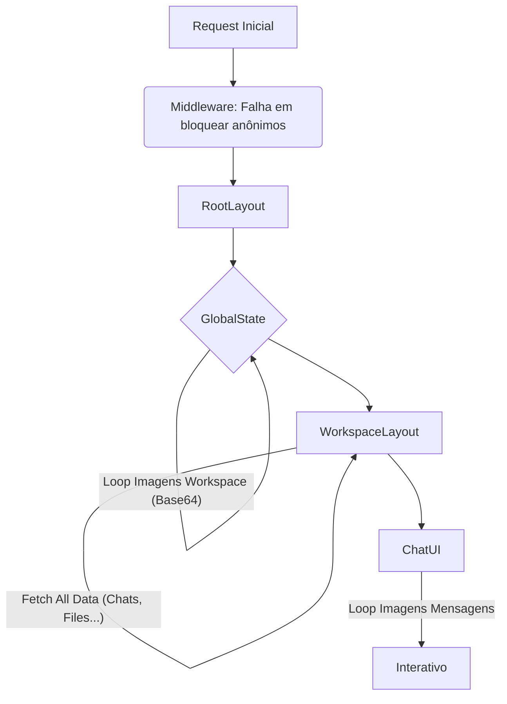

# Análise de Velocidade de Carregamento e Fluxo de Autenticação

**Data:** 18 de Dezembro de 2024
**Status:** Diagnóstico Revisado e Aprofundado

## 1. Resumo Executivo (Atualizado)

A investigação confirmou que a "tela preta" é causada por uma arquitetura de **"Waterfalls Aninhados" (Cascata sobre Cascata)**. Não existe apenas um ponto de bloqueio, mas uma sequência de barreiras de carregamento que o usuário precisa atravessar.

Além disso, o **Middleware** não está protegendo as rotas adequadamente, permitindo que lógica de renderização inicie mesmo para usuários não autenticados, delegando a segurança para o Client-Side, o que é ineficiente e inseguro.

---

## 2. Fluxo de Autenticação e Middleware

### Problema Crítico no Middleware (`middleware.ts`)
Ao contrário do esperado, o middleware **NÃO bloqueia** acesso a rotas protegidas (como `/[workspaceid]/chat`).
*   Ele executa `i18nRouter`.
*   Tenta atualizar a sessão Supabase.
*   A única lógica de redirecionamento explicita é `redirectToChat` (apenas se estiver na raiz `/`).
*   **Resultado**: O usuário não autenticado chega até o componente React da página (`WorkspaceLayout`), que então roda um `useEffect` para checar a sessão e redirecionar para `/login`. Isso desperdiça recursos do servidor e tempo do cliente carregando bundles JS desnecessários.

---

## 3. Diagnóstico de Performance (A "Tela Preta" Infinita)

A lentidão é o resultado da soma de três camadas de bloqueios sequenciais:

### Camada 1: `GlobalState` (Bloqueio Global)
*   Carrega perfil, workspaces e modelos.
*   **Erro Crítico**: Loop sequencial convertendo imagens de Workspaces para Base64 na Main Thread.

### Camada 2: `WorkspaceLayout` (Bloqueio de Rota)
Arquivo: `app/[locale]/[workspaceid]/layout.tsx`
Só inicia após o `GlobalState` terminar.
*   **Erro Crítico**: Repete o mesmo padrão de erro.
    *   Busca todos os assistentes do workspace.
    *   **Loop Sequencial (Blocker)**: Itera sobre cada assistente para baixar imagem -> converter para Blob -> converter para Base64.
    *   Busca Chats, Collections, Files, Folders, Models, Presets, Prompts, Tools (tudo sequencialmente ou em grupos não otimizados).
*   Enquanto isso roda, o componente retorna `<Loading />`, mantendo a tela travada.

### Camada 3: `ChatUI` (Bloqueio de Interação)
Arquivo: `components/chat/chat-ui.tsx`
Só inicia após o `WorkspaceLayout` terminar.
*   Busca mensagens do chat.
*   **Loop Sequencial**: Baixa e converte imagens das mensagens para Base64.

### Veredito: O "Waterfall da Morte"


---

## 4. Recomendações Técnicas Corretivas

### Imediatas (Correção de Gargalos)
1.  **Remover Conversão Base64 (Prioridade Zero)**:
    *   Substituir toda lógica de `fetch(url) -> blob -> base64` por uso direto de URLs públicas/assinadas nos componentes de imagem.
    *   Isso elimina o processamento CPU-bound e o download sequencial bloqueante em `GlobalState`, `WorkspaceLayout` e `ChatUI`.

2.  **Paralelismo (Promise.all)**:
    *   No `WorkspaceLayout`, agrupar as chamadas de `getAssistants`, `getChats`, `getCollections`, etc., em um único `Promise.all`.

3.  **Reforçar Middleware**:
    *   Implementar verificação estrita no `middleware.ts`: Se não houver sessão e a rota não for pública, redirecionar para `/login` imediatamente, antes de qualquer renderização React.

### Arquiteturais (Médio Prazo)
1.  **Server Components para Data Fetching**:
    *   Mover a busca de dados inicial do `WorkspaceLayout` para o próprio componente (que já é, ou deveria ser, um Server Component se removido o `"use client"`), passando dados como props.
    *   Isso elimina o estado de `Loading` inicial do cliente.

2.  **React Query**:
    *   Substituir os contextos gigantes (`GlobalState`, `ChatbotUIContext`) por hooks de data fetching com cache (SWR ou TanStack Query) para evitar buscar tudo de uma vez.

## 5. Observabilidade e Logging (Atualizado)

Adicionar logs para medir o impacto de cada camada:

```typescript
// WorkspaceLayout
console.time("Workspace:Init");
console.time("Workspace:ProcessAssistantImages"); // Medir o loop base64
// ...
console.timeEnd("Workspace:ProcessAssistantImages");
console.timeEnd("Workspace:Init");
```
